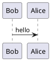

## 包含内存操作相关的系统调用和 C 函数
- brk
- sbrk
- malloc
- free

## brk() 和 sbrk()
功能：
- 修改数据段的大小



头文件
```Clang
include <unistd.h>
```

```Clang
void * brk(const void *addr);

void * sbrk(int incr);

```

## malloc() 和 free()
```Clang
```

